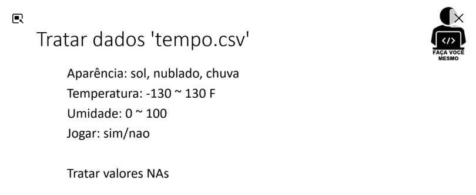

```{r setup, include=FALSE}
knitr::opts_chunk$set(echo = TRUE)
```

## Problema



## Carregamento e Visualização dos dados

```{r}
dados = read.csv("../dados/tempo.csv", sep=";", na.strings = "", stringsAsFactors = TRUE)
head(dados)
# Resumo Estatístico
summary(dados)
```


## Análise Exploratória de Dados (EDA)

* Aparência

```{r}
table(dados$Aparencia)
barplot(table(dados$Aparencia), main="Aparência")
```

* Temperatura

Resumo Estatístico


```{r}
summary(dados$Temperatura)
# Domínio
Tmin = -130
Tmax = 130
```

```{r}
hist(dados$Temperatura, main="Distribuição de dados de temperatura", xlab="Temperatura ( °F)", ylab="Frequência")
```


### Tratamento de dados

* Aparência

```{r}
# Tabela de frequências
freq_table = table(dados$Aparencia)
# Índice da tabela com maior frequência
max_idx = which.max(freq_table)
# Nome correspondente ao índice de maior frequência
max_value_name = names(freq_table)[max_idx]
max_value_name
```


```{r}
# Valores de domínio para a coluna Aparencia
dominio = c("sol", "nublado", "chuva")
# Substituição dos valores fora de domínio
dados[!dados$Aparencia %in% dominio, ]$Aparencia = max_value_name
# Ajuste 
dados$Aparencia = factor(dados$Aparencia)
# Resultado
barplot(table(dados$Aparencia), main="Aparência")

```


* Temperatura

```{r}
summary(dados$Temperatura)
# Domínio
Tmin = -130
Tmax = 130
```

Dado que os valores de domínio da Temperatura estão entre $`r Tmin`$°F e $`r Tmax`$°F, existe `r nrow(dados[dados$Temperatura < Tmin | dados$Temperatura > Tmax, ])` observações fora do domínio, conforme mostrado no boxplot abaixo:

```{r}
boxplot(dados$Temperatura)
```

Substituiremos o valor fora de domínio pela mediana dos dados de temperatura:

```{r}
dados[dados$Temperatura < Tmin | dados$Temperatura > Tmax, ]$Temperatura = median(dados$Temperatura, na.rm = TRUE)
# Resultado
boxplot(dados$Temperatura, ylab="Temperatura (°F)")
hist(dados$Temperatura, main="Distribuição de dados de Temperatura", xlab="Temperatura (°F)", ylab="Frequência")
```


